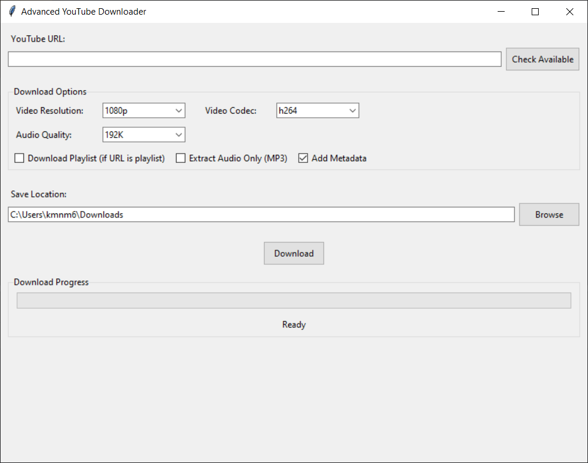

# Advanced YouTube Downloader

A feature-rich YouTube video downloader with a modern graphical user interface built using Python and tkinter.

## Features

- Download videos in various resolutions (up to 8K)
- Multiple codec support (h264, h265, av1, vp9)
- Audio quality selection
- Playlist download support
- Audio extraction to MP3
- Metadata and thumbnail embedding
- Progress tracking
- Custom save location

## Requirements

- Python 3.7+
- FFmpeg (required for video/audio processing)
- Required packages listed in requirements.txt

## Installation

1. Install FFmpeg:
   - Windows: Download from https://www.ffmpeg.org/download.html
   - Linux: `sudo apt install ffmpeg`
   - macOS: `brew install ffmpeg`

2. Clone this repository:
```bash
git clone https://github.com/7Manan7/youtube-downloader.git
cd youtube-downloader
```

3. Install required packages:
```bash
pip install -r requirements.txt
```

## Usage

Run the application:
```bash
python youtube_downloader.py
```

1. Enter a YouTube URL
2. Select desired video quality and format
3. Choose save location
4. Click Download

## Screenshots



## License

MIT License - See LICENSE file for details